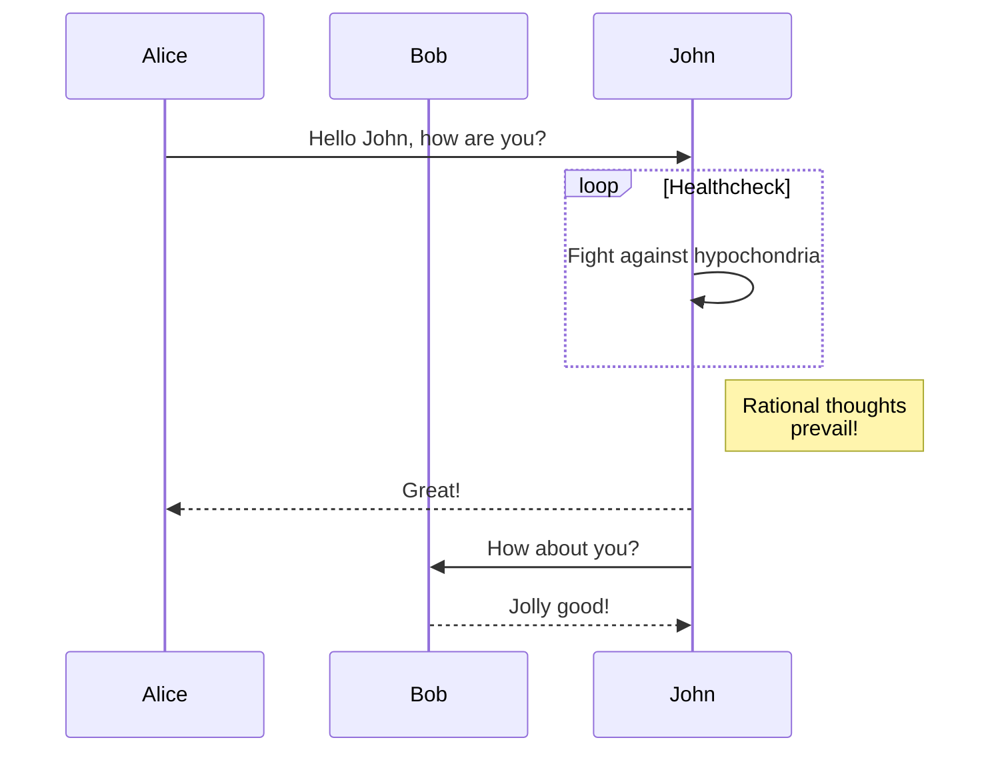
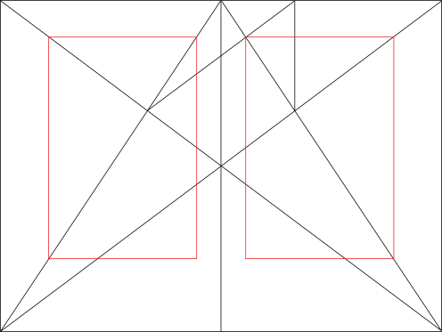

+++
title = "کدهای کوتاه"
date = "2022-10-20"
description = "کدهای کوتاه پوسته Kita."
[taxonomies]
tags = ["markdown", "css", "html"]
[extra]
mermaid = true
+++

پوسته Kita چندین کد کوتاه ارائه می‌دهد.

تا به حال درباره کدهای کوتاه نشنیده‌اید؟ برای اطلاعات بیشتر [مستندات Zola](https://www.getzola.org/documentation/content/shortcodes/) را ببینید.

## Mermaid

برای استفاده از Mermaid در صفحه خود، باید `extra.mermaid = true` را در frontmatter صفحه تنظیم کنید.

```markdown
+++
title = "عنوان صفحه شما"

[extra]
mermaid = true
+++
```

سپس می‌توانید از کد کوتاه `mermaid()` استفاده کنید:

```markdown


graph TD;
A-->B;
A-->C;
B-->D;
C-->D;


```

این به صورت زیر نمایش داده می‌شود:



graph TD;
A-->B;
A-->C;
B-->D;
C-->D;



علاوه بر این، می‌توانید بلوک کد را داخل کد کوتاه `mermaid()` استفاده کنید و بلوک کد نادیده گرفته می‌شود.

بلوک کد از شکستن قالب‌بندی mermaid توسط فرمت‌کننده جلوگیری می‌کند.

````markdown





````

این به صورت زیر نمایش داده می‌شود:






## هشدار

کد کوتاه `admonition()` یک بنر نمایش می‌دهد تا به شما کمک کند توجه را در صفحه خود قرار دهید.

این روش دیگری برای نوشتن هشدار به سبک GitHub است، اما از عناوین سفارشی پشتیبانی می‌کند.

می‌توانید از کد کوتاه `admonition()` به صورت زیر استفاده کنید:

```markdown

هشدار `note`.

```


هشدار `note`.



هشدار `tip`.



هشدار `important`.



هشدار `warning`.



هشدار `caution`.


## گالری

کد کوتاه `gallery()` یک گالری تصویر قابل کلیک ساده فقط HTML است که تمام تصاویر را از دارایی‌های صفحه نمایش می‌دهد.

این از [مستندات Zola](https://www.getzola.org/documentation/content/image-processing/) گرفته شده است

```markdown
{{/* gallery() */}}
```

{{ gallery() }}

## SVG درون‌خطی

کد کوتاه `inline_svg()` برای جاسازی تصاویر SVG مستقیماً در یک صفحه وب استفاده می‌شود، به جای شامل کردن آنها از طریق تگ ``.

می‌توانید از کدهای کوتاه `inline_svg()` به صورت زیر استفاده کنید:

```markdown



```





اگر نمی‌خواهید زیرنویس زیر تصویر نمایش داده شود، می‌توانید متن `alt` تصویر Markdown را به رشته خالی، `Inline SVG`، `inline-svg` یا `inline_svg` تنظیم کنید.

```markdown















```




